# FerrumPy 内部机制文档

本文档详细描述了FerrumPy原理和工作机制，供理解和参考。

## 目录

1. [evcxr 工作机制](#1-evcxr-工作机制)
2. [断点值与类型信息提取](#2-断点值与类型信息提取)
3. [伴生库生成机制](#3-伴生库生成机制)
4. [模块架构图](#4-模块架构图)

---

## 1. evcxr 工作机制

### 1.1 什么是 evcxr

[evcxr](https://github.com/evcxr/evcxr) 是一个 Rust 的交互式求值环境，类似于 Python 的 REPL。FerrumPy 使用 evcxr 作为 REPL 引擎，让用户可以在调试断点处执行任意 Rust 代码。

### 1.2 evcxr 的核心原理

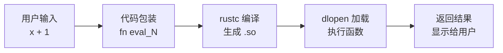

**关键步骤**：

1. **代码包装**：将用户输入的表达式包装成完整的 Rust 函数
2. **增量编译**：只编译新增的代码，复用之前的编译结果
3. **动态加载**：编译生成 `.so` 动态库，通过 `dlopen` 加载执行
4. **状态保持**：使用 `static` 变量保存跨表达式的状态

### 1.3 跨表达式状态保持机制

**核心问题**：在 REPL 中，用户期望之前定义的变量、函数、结构体在后续表达式中可用。例如：

```rust
>> let x = 42;
>> x + 1
43
```

但每次输入都会编译成一个**新的动态库**并加载执行。普通的 `let` 变量在函数执行完毕后就会被销毁。

**evcxr 的解决方案**：使用 `static` 变量 + `OnceLock`

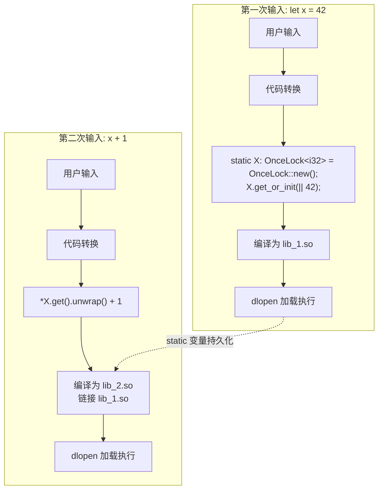

**详细过程**：

1. **变量定义 `let x = 42`**：
   - evcxr 将其转换为 `static X: OnceLock<i32> = OnceLock::new(); X.get_or_init(|| 42);`
   - `OnceLock` 确保值只初始化一次
   - `static` 变量的生命周期为整个进程

2. **后续访问 `x + 1`**：
   - evcxr 知道 `x` 是之前定义的变量，将其替换为 `*X.get().unwrap()`
   - 新编译的 `.so` 文件会链接之前的 `.so`，从而访问到 `X` 这个 static 变量

3. **结构体定义**：
   ```rust
   >> struct Point { x: i32, y: i32 }
   ```
   - 结构体定义被放入一个持久化的 Rust 模块中
   - 后续编译都会包含这个模块的定义

4. **函数定义**：
   ```rust
   >> fn add(a: i32, b: i32) -> i32 { a + b }
   ```
   - 函数定义类似结构体，被添加到持久化代码中
   - 后续表达式可以直接调用

### 1.4 rust-analyzer 在 evcxr 中的作用

evcxr 集成了 **rust-analyzer** 来提供代码补全和智能提示：

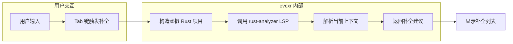

**工作原理**：

1. **虚拟项目**：evcxr 在内存中维护一个完整的 Rust 项目结构（Cargo.toml + src/lib.rs）
2. **状态同步**：所有已定义的变量、函数、结构体都被写入这个虚拟项目
3. **LSP 请求**：当用户请求补全时，evcxr 调用 rust-analyzer 的 `textDocument/completion` LSP 方法
4. **上下文感知**：rust-analyzer 基于完整的项目上下文提供精确的补全

**FerrumPy 中的使用**：我们在 `repl_ui.py` 中启用了补全功能，通过 evcxr 的 `:complete` 命令获取建议。

### 1.5 FerrumPy 中的 evcxr 使用

FerrumPy 使用 evcxr 的**子进程模式**，通过独立的 `ferrumpy-repl-worker` 二进制执行：

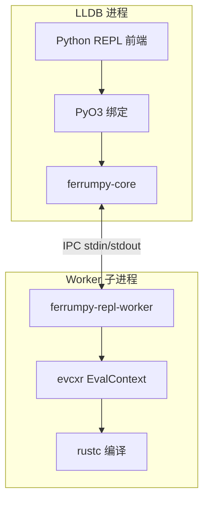

```rust
// ferrumpy-core/src/repl/session.rs
let cmd = Command::new(&worker_path);
let (eval_context, outputs) = EvalContext::with_subprocess_command(cmd)?;
```

**为什么使用子进程模式**：
- 隔离 LLDB 进程和 evcxr 编译环境
- 避免 Rust 编译器与 LLDB 的冲突
- 支持优雅的中断和恢复机制（Ctrl+C 不会杀死 LLDB）

---

## 2. 断点值与类型信息提取

### 2.1 背景知识：LLDB 与 Python 的交互

#### 什么是 SBValue

LLDB 使用 C++ 实现，通过 **SB API**（Scripting Bridge API）暴露给 Python。`SBValue` 是 LLDB 中表示"值"的核心类。

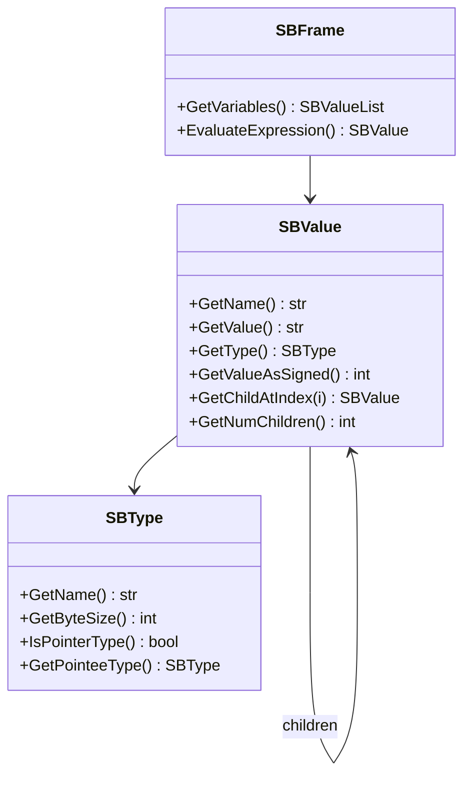

**关键概念**：

- **SBValue**：表示调试目标中的一个值（变量、表达式结果等）
- **SBType**：表示值的类型信息
- **SBFrame**：表示一个栈帧，包含局部变量和参数

#### LLDB 如何读取被调试程序的内存

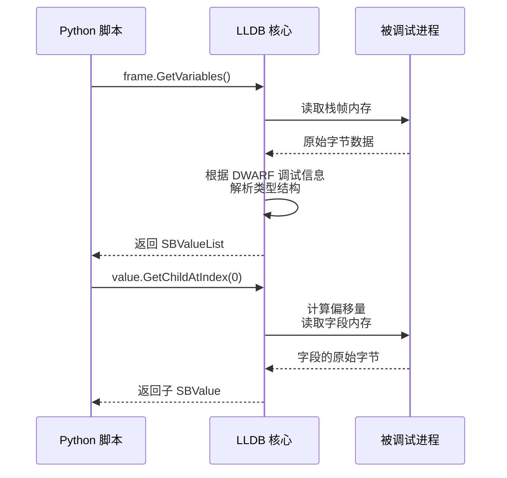

**DWARF 调试信息**：

- 编译器（rustc）在编译时会生成 DWARF 调试信息
- DWARF 描述了每个类型的结构：字段名、偏移量、大小
- LLDB 使用 DWARF 将原始内存字节解释为有意义的值

### 2.2 值提取的整体流程

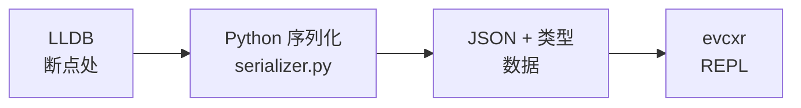

### 2.3 Python 端：值序列化

核心文件：`python/ferrumpy/serializer.py`

**步骤 1：获取当前帧的变量**

```python
def serialize_frame(frame: lldb.SBFrame) -> dict:
    """序列化栈帧中的所有变量"""
    variables = {}
    
    # 获取局部变量和参数
    # GetVariables(arguments, locals, statics, in_scope_only)
    for var in frame.GetVariables(True, True, True, True):
        name = var.GetName()
        value = serialize_value(var)
        type_str = var.GetType().GetName()
        variables[name] = {
            "value": value,
            "type": type_str
        }
    
    return variables
```

**步骤 2：递归序列化值**

```python
def serialize_value(sbvalue: lldb.SBValue) -> Any:
    """将 SBValue 转换为 Python 可序列化的值"""
    type_name = sbvalue.GetType().GetName()
    
    # 基本类型 - 直接读取
    if is_integer_type(type_name):
        return sbvalue.GetValueAsSigned()
    
    # String 类型 - 需要解析 Rust String 的内部结构
    if type_name == "alloc::string::String":
        return extract_string(sbvalue)
    
    # Vec<T> 类型 - 遍历元素
    if type_name.startswith("alloc::vec::Vec"):
        return extract_vec(sbvalue)
    
    # 结构体类型 - 递归序列化字段
    if is_struct_type(sbvalue):
        return {
            field.GetName(): serialize_value(field)
            for field in sbvalue
        }
    
    # ... 其他类型处理
```

**Rust String 的内部结构**：

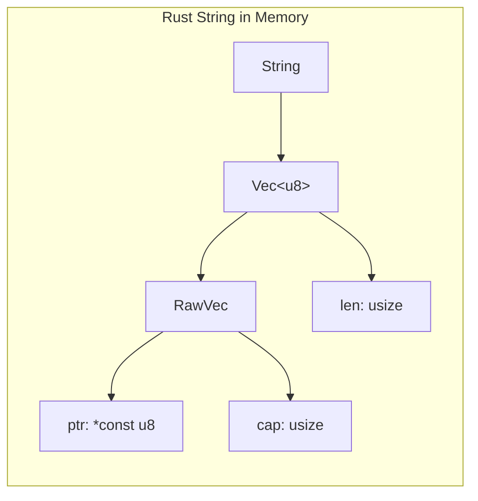

要提取 String 的值，需要：
1. 找到 `ptr` 指向的堆内存地址
2. 读取 `len` 字节的数据
3. 将字节转换为 UTF-8 字符串

### 2.4 类型信息提取

LLDB 提供的类型信息通过 `SBValue.GetType().GetName()` 获取。常见格式：

| LLDB 返回的类型名 | 对应的 Rust 类型 |
|-------------------|------------------|
| `alloc::string::String` | `String` |
| `alloc::vec::Vec<i32, alloc::alloc::Global>` | `Vec<i32>` |
| `core::option::Option<i32>` | `Option<i32>` |
| `MyStruct` | 用户定义的结构体 |

**类型名规范化**：

```python
def normalize_type(lldb_type: str) -> str:
    """将 LLDB 类型名转换为 Rust 代码可用的类型名"""
    # 移除 alloc:: 前缀
    result = lldb_type.replace("alloc::", "")
    # 移除 core:: 前缀
    result = result.replace("core::", "")
    # 简化 allocator 泛型参数
    result = re.sub(r', \w+::alloc::Global', '', result)
    return result
```

### 2.5 Rust 端：值恢复

核心文件：`ferrumpy-core/src/repl/session.rs`

**生成静态变量访问器**：

```rust
fn generate_static_item(&self, name: &str, value: &Value, type_hint: &str) -> String {
    format!(r#"
        static {}_CELL: OnceLock<{}> = OnceLock::new();
        
        pub fn {}() -> &'static {} {{
            {}_CELL.get_or_init(|| {{
                serde_json::from_str::<{}>(r#"{}"#).unwrap()
            }})
        }}
    "#, name.to_uppercase(), type_hint, name, type_hint, 
        name.to_uppercase(), type_hint, json_string)
}
```

---

## 3. 伴生库生成机制

### 3.1 为什么需要伴生库

问题：evcxr 无法直接访问被调试程序中的**用户自定义类型**。

解决方案：生成一个"伴生库"（companion library），包含用户项目的所有类型定义。

### 3.2 生成流程

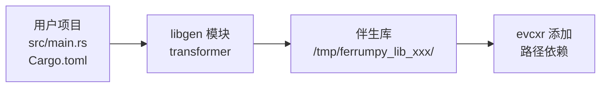

核心文件：`ferrumpy-core/src/libgen/`

### 3.3 代码转换规则

**transformer.rs** 对源代码进行以下转换：

| 原始代码 | 转换后 |
|----------|--------|
| `struct User { name: String }` | `pub struct User { pub name: String }` |
| `fn main() { ... }` | （删除） |
| `enum Status { ... }` | `#[derive(Serialize, Deserialize)] pub enum Status { ... }` |

**关键处理**：

1. **公开化**：所有 struct/enum/fn 改为 `pub`
2. **添加 serde derive**：让类型支持 JSON 序列化
3. **移除 main 函数**：只保留类型定义
4. **过滤 no_std 属性**：避免与 serde 冲突

### 3.4 需要注意的细节

#### 引用类型无法序列化

```rust
// ❌ 这种类型无法添加 serde derive
pub struct Iterator<'a> {
    data: &'a [u64],  // 引用无法 Deserialize
}
```

**解决方案**：检测包含引用的类型，跳过 serde derive。

#### 不支持的类型

以下类型会被跳过，不会尝试恢复：

- 迭代器适配器：`Skip<Args>`, `Map<...>`, `Filter<...>`
- 环境类型：`Args`, `Stdin`, `Stdout`
- 原始指针：`*const T`, `*mut T`

```rust
fn is_type_likely_available(&self, type_hint: &str) -> bool {
    let unsupported_patterns = [
        "Skip<", "Take<", "Map<", "Filter<",
        "Args", "Stdin", "*const", "*mut",
        // ...
    ];
    !unsupported_patterns.iter().any(|p| type_hint.contains(p))
}
```

#### Cargo.toml 生成

生成的伴生库 Cargo.toml 需要：

1. 复制用户项目的依赖
2. 添加 serde 依赖
3. 使用 TOML 内联表格式序列化复杂依赖

```rust
// 正确的格式
pyo3 = { version = "0.22", features = ["extension-module"] }

// 错误的格式（之前的 bug）
pyo3 = features = ["extension-module"]
```

---

## 4. 模块架构图

### 4.1 整体架构

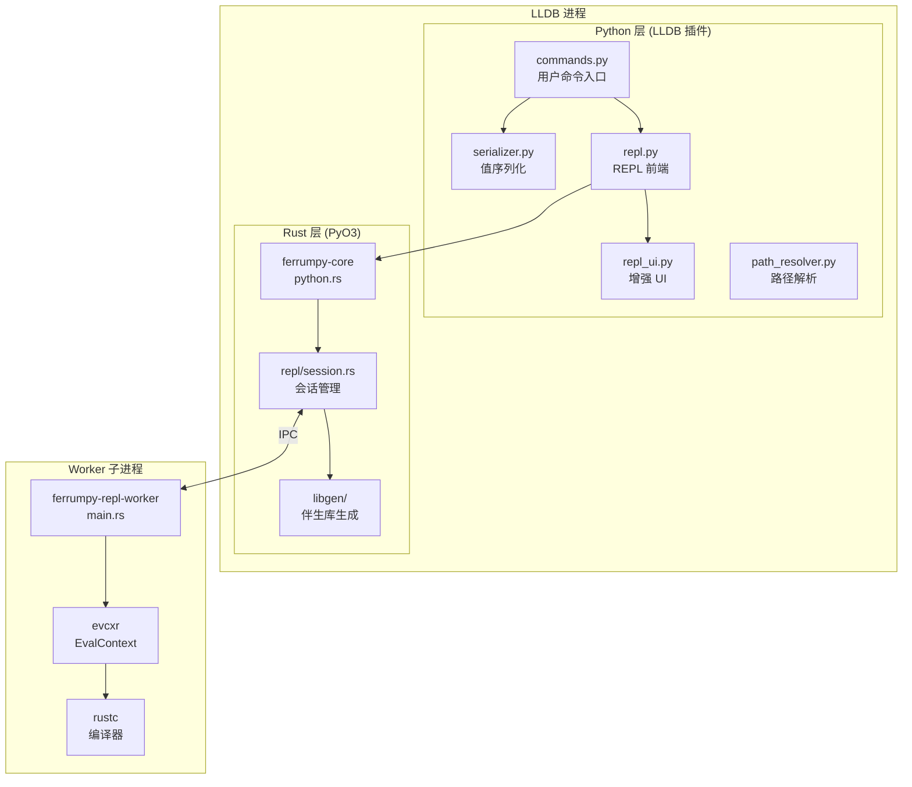

### 4.2 数据流

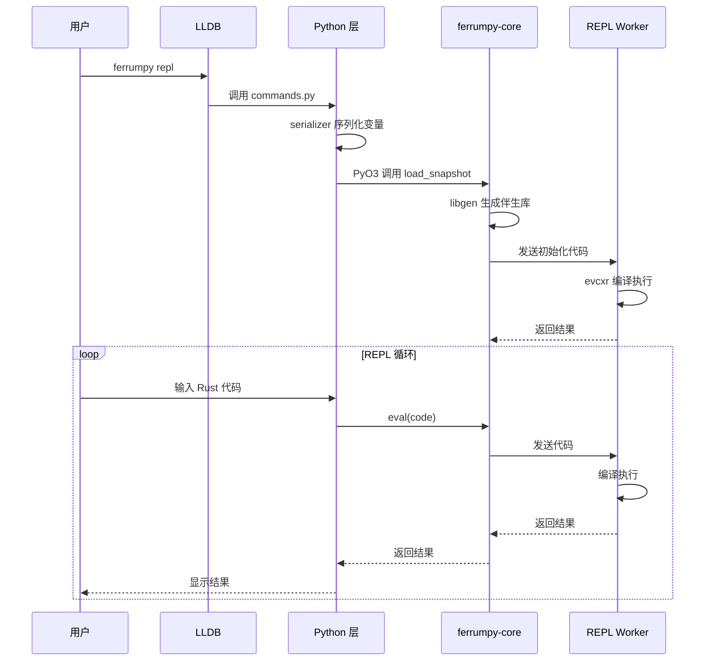

### 4.3 文件职责表

| 文件 | 职责 |
|------|------|
| `python/ferrumpy/commands.py` | LLDB 命令注册和入口 |
| `python/ferrumpy/serializer.py` | LLDB 值到 JSON 的序列化 |
| `python/ferrumpy/repl.py` | REPL 前端：循环、历史、快照 |
| `python/ferrumpy/repl_ui.py` | 增强 REPL UI (prompt_toolkit) |
| `python/ferrumpy/path_resolver.py` | 路径表达式解析 `a.b[0].c` |
| `ferrumpy-core/src/repl/session.rs` | REPL 会话管理、值恢复 |
| `ferrumpy-core/src/libgen/mod.rs` | 伴生库生成入口 |
| `ferrumpy-core/src/libgen/transformer.rs` | AST 转换（公开化、添加 derive） |
| `ferrumpy-core/src/python.rs` | PyO3 绑定定义 |
| `ferrumpy-repl-worker/src/main.rs` | evcxr 子进程入口 |

---

## 附录：关键数据结构

### Snapshot JSON 格式

```json
{
  "variables": {
    "x": { "value": 42, "type": "i32" },
    "name": { "value": "hello", "type": "alloc::string::String" },
    "items": { 
      "value": [1, 2, 3], 
      "type": "alloc::vec::Vec<i32>" 
    }
  },
  "lib_path": "/tmp/ferrumpy_lib_12345",
  "lib_name": "ferrumpy_snapshot",
  "lib_use_stmt": "use ferrumpy_snapshot::*;"
}
```

### 类型 Hint 格式

```json
{
  "x": "i32",
  "name": "String",
  "items": "Vec<i32>",
  "user": "MyStruct"
}
```

---

*文档版本：0.1.3*  
*最后更新：2026-01-08*
